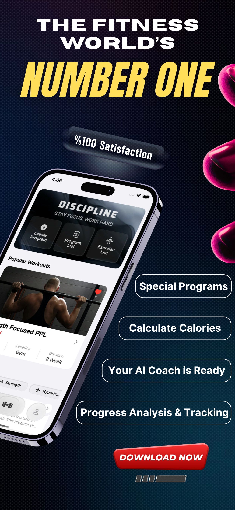
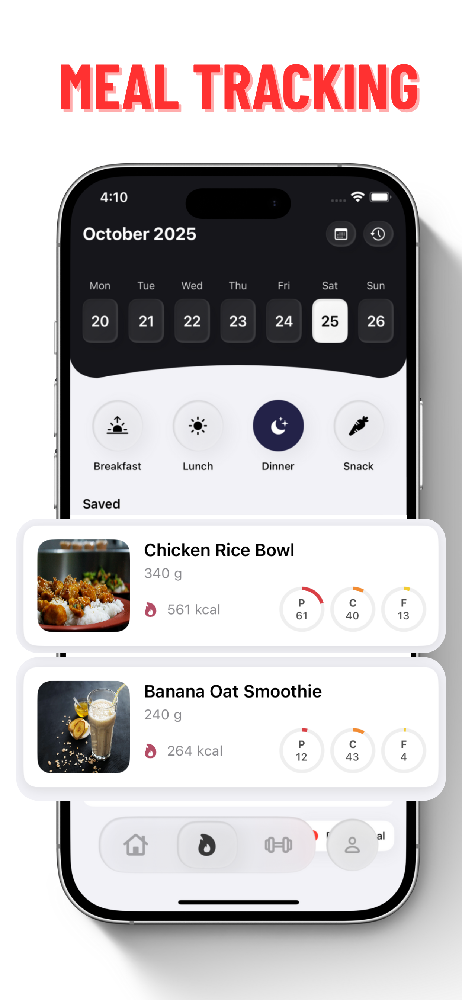
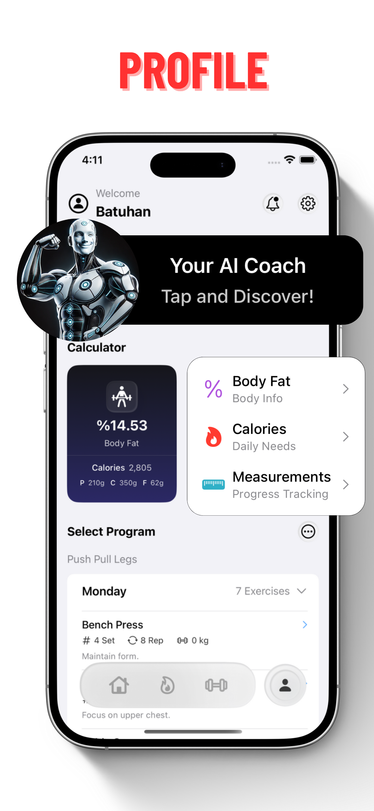
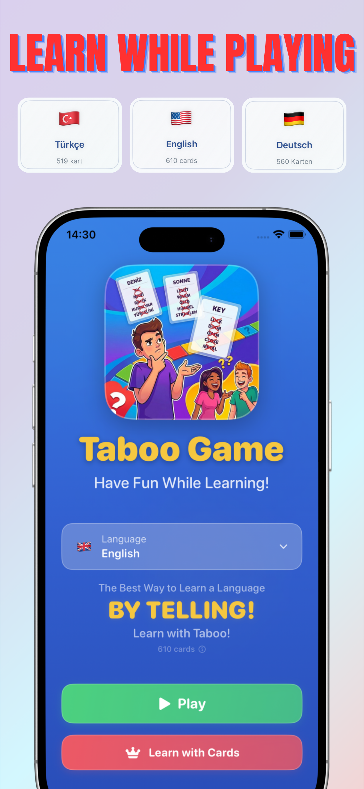
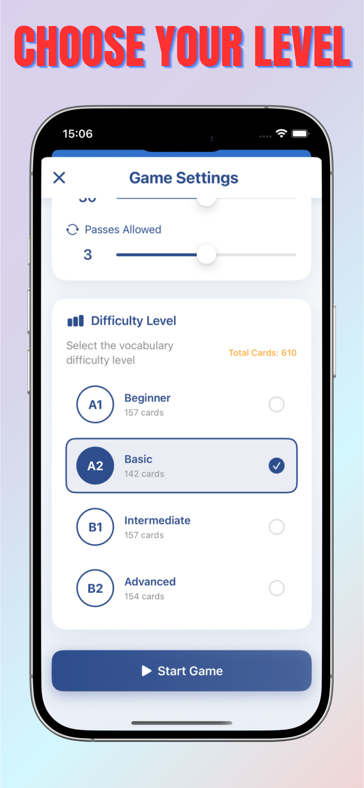
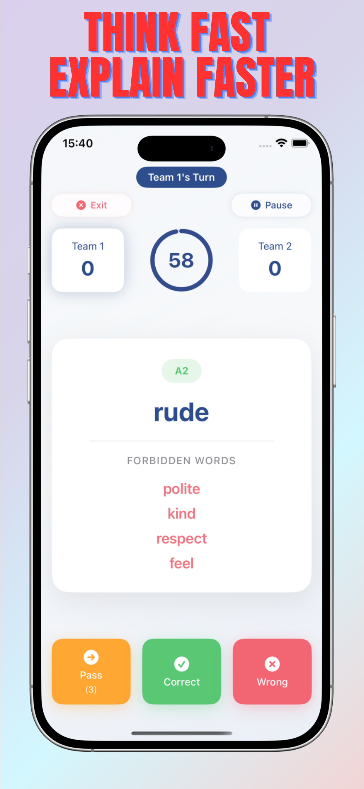
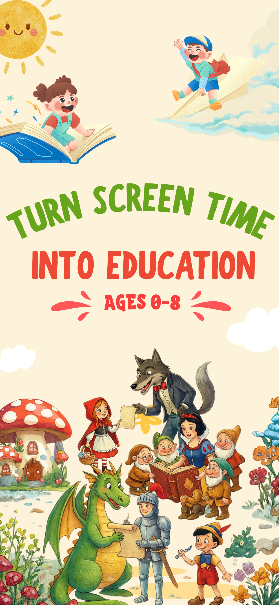
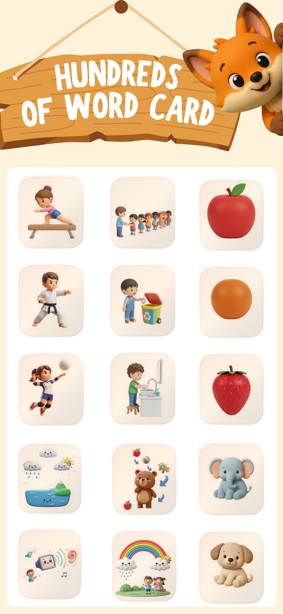
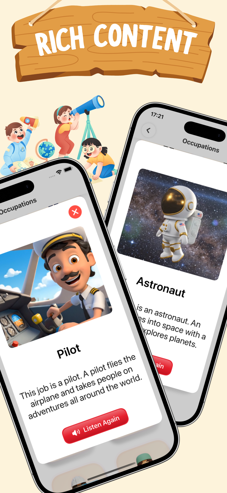

<h1 align="center">Hi, I'm Batuhan Arda</h1>

  <strong>iOS Developer</strong> crafting apps with Swift & SwiftUI

  
  
  

---

### About Me

- Building iOS applications with **Swift** and **SwiftUI**
- Focused on clean architecture, protocol-oriented design, and modern concurrency
- Published apps on the **App Store** with real users
- Currently working on open-source **SPM libraries** for the iOS community

---

### Tech Stack

  
  
  
  
  

---

### Apps on the App Store

<table>
  <tr>
    <td align="center" colspan="3">
      <h4>🏋️ Base Workout</h4>
      
A fitness app for tracking workouts, calories, and progress. Features training programs, calorie tracking, and detailed progress analytics.

    </td>
  </tr>
  <tr>
    <td></td>
    <td></td>
    <td></td>
  </tr>
  <tr>
    <td align="center" colspan="3">
      
    </td>
  </tr>
</table>

 

<table>
  <tr>
    <td align="center" colspan="3">
      <h4>🎭 Taboo Words</h4>
      
A taboo word guessing game with multiple language options. Play with friends and family in your preferred language.

    </td>
  </tr>
  <tr>
    <td></td>
    <td></td>
    <td></td>
  </tr>
  <tr>
    <td align="center" colspan="3">
      
    </td>
  </tr>
</table>

 

<table>
  <tr>
    <td align="center" colspan="3">
      <h4>🗣️ Konuş Benimle</h4>
      
An educational app that supports children's language development. Helps kids improve their speech and language skills through interactive exercises.

    </td>
  </tr>
  <tr>
    <td></td>
    <td></td>
    <td></td>
  </tr>
  <tr>
    <td align="center" colspan="3">
      
    </td>
  </tr>
</table>

---

### Open Source Projects

| Project | Description | Tech |
|---------|-------------|------|
| [**NetworkKit**](https://github.com/ardabatu22/NetworkKit) | Async/await networking library with interceptors & retry | Swift, URLSession, SPM |
